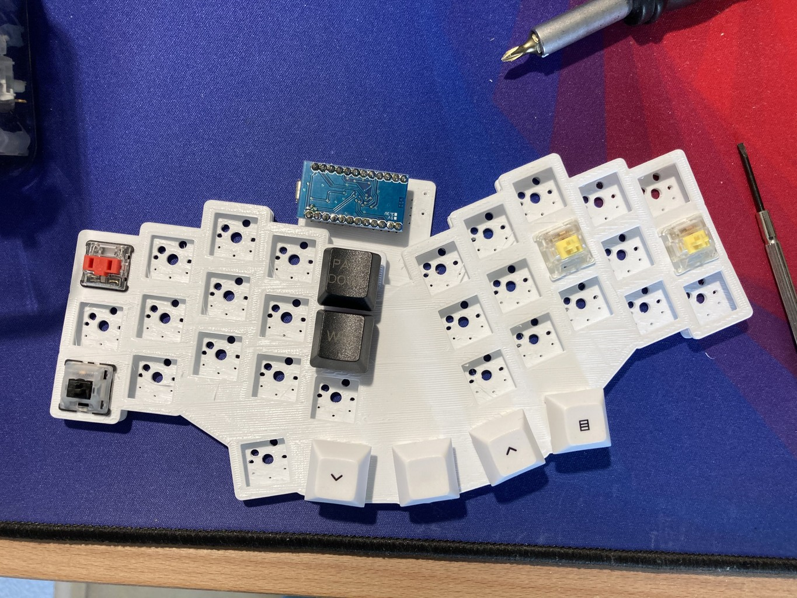
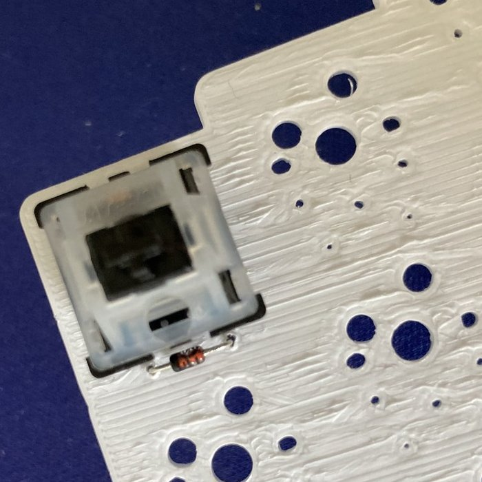
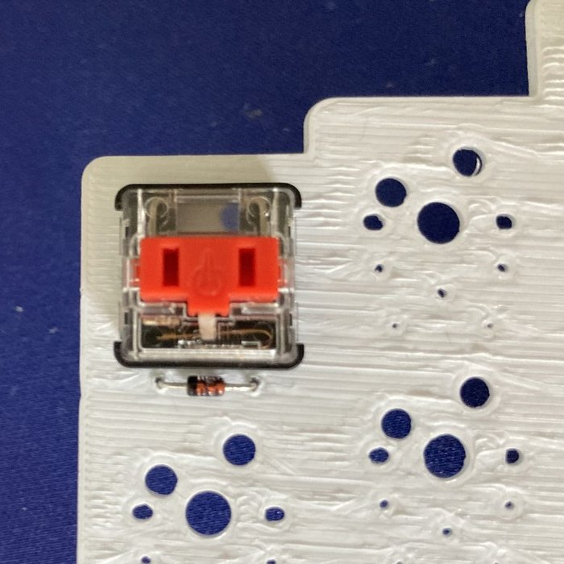

# Prototype

## Uni1 1st Prototype

The "PCB" was 3d printed with [KiCad Step Up](https://github.com/easyw/kicadStepUpMod/) to see if the position of the diodes work for Kailh V1 and MX style Switches and if the stagger and thumb key positioning is comfortable.

Overview:

Diode position for MX Switch:

Diode position for Choc v1 Switch:

Observations:
- Printing the Prototype with a 3d Printer works :rocket:
- Position of alphas Diodes is OK
- Position for ProMicro is good, space for the Display is OK, reset button should is OK
- Thumbfan diodes should be above the keys
- I need a mors aggressive pinky stagger or have a 2 pinky +1 outer key layout that can be found on a [balbuzard](https://github.com/brow/balbuzard)